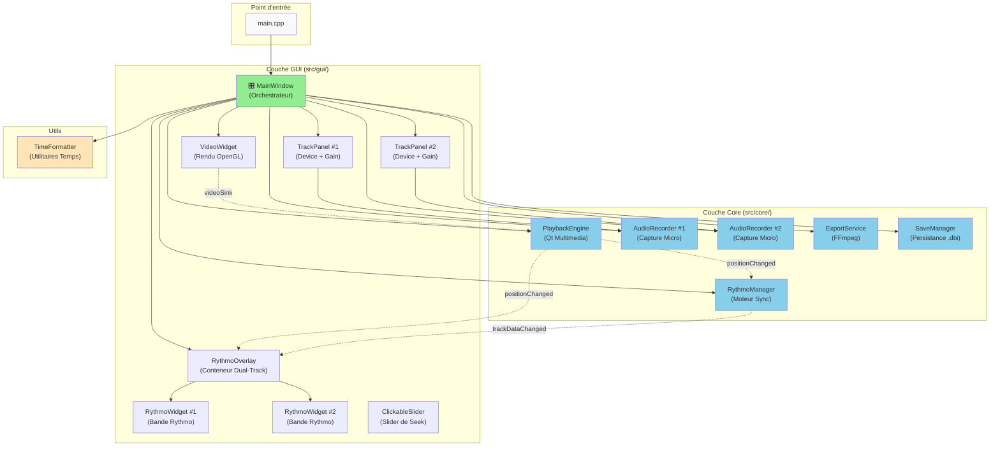
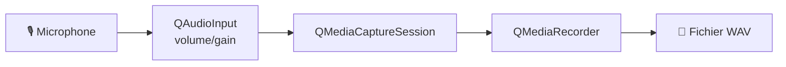
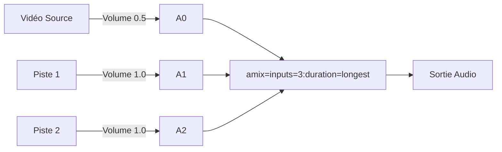
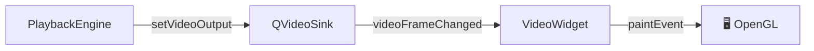
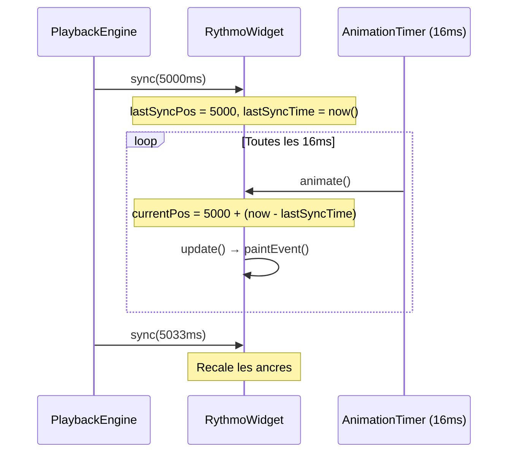
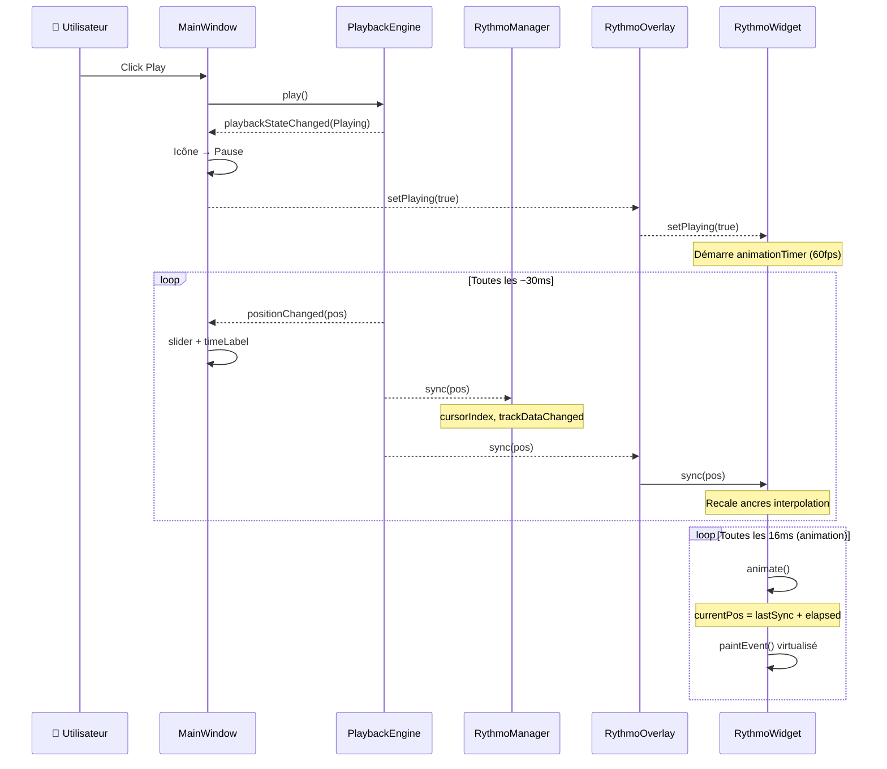
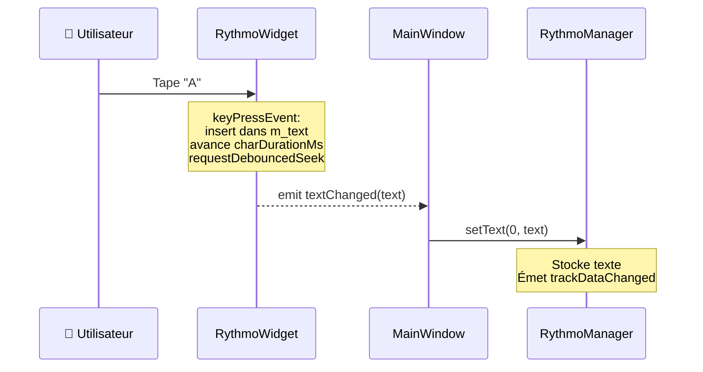
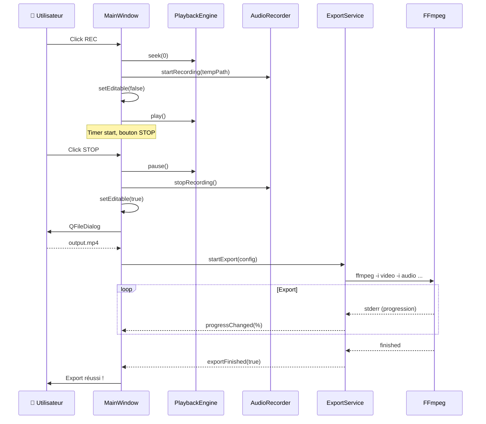

# 🧠 THECODE.md — La référence complète du code DubInstante

> **DubInstante** est un studio de doublage vidéo professionnel.
> Ce document couvre de manière exhaustive le code source des couches Core, GUI et Utils.
> Dernière mise à jour : v0.9.0 (version CMake) — mars 2026.

## 📖 À qui s'adresse ce document ?

Ce document s'adresse aux **développeurs** qui veulent :
- Comprendre l'architecture et les patterns
- Déboguer ou tracer les flux de signaux
- Ajouter des fonctionnalités en respectant la séparation en 3 couches
- Optimiser les goulots d'étranglement de performance
- Étendre la base de code en toute confiance

**Temps de lecture estimé :** 45 minutes pour la vue d'ensemble, 2+ heures pour le deep dive.

---

## Table des matières

1. [🏗️ Architecture Globale](#️-architecture-globale) — Design 3 couches, vue des composants
2. [📁 Arborescence des fichiers](#-arborescence-des-fichiers) — Arborescence complète
3. [⚙️ Core — Logique Métier](#️-core--logique-métier) — Logique métier (5 composants)
   - [PlaybackEngine](#playbackengine) — Wrapper lecture vidéo/audio
   - [RythmoManager](#rythmomanager) — Sync & gestion du texte
   - [AudioRecorder](#audiorecorder) — Capture micro
   - [ExportService](#exportservice) — Orchestration FFmpeg
   - [SaveManager](#savemanager) — Persistance projet (.dbi)
4. [🖼️ GUI — Interface Utilisateur](#️-gui--interface-utilisateur) — Widgets UI (6 composants)
   - [MainWindow](#mainwindow) — Orchestrateur & gestion d'état
   - [VideoWidget](#videowidget) — Rendu OpenGL
   - [RythmoWidget](#rythmowidget) — Affichage/édition bande rythmo
   - [RythmoOverlay](#rythmooverlay) — Conteneur dual-track
   - [TrackPanel](#trackpanel) — Contrôles audio
   - [ClickableSlider](#clickableslider) — Slider de seek interactif
5. [🔧 Utils — Utilitaires](#-utils--utilitaires) — Helpers partagés
   - [TimeFormatter](#timeformatter) — Utilitaires de formatage temps
6. [🔀 Flux de Données & Connexions Signal/Slot](#-flux-de-données--connexions-signalslot) — Diagrammes de flux
   - [Flux de Lecture (Playback)](#flux-de-lecture-playback)
   - [Flux d'Édition de Texte](#flux-dédition-de-texte)
   - [Flux d'Enregistrement & Export](#flux-denregistrement--export)
7. [💾 Format de fichier .dbi](#-format-de-fichier-dbi) — Spécification du format projet
   - [Structure binaire](#structure-binaire)
   - [Payload JSON](#payload-json)
   - [Mode ZIP (saveWithMedia)](#mode-zip-savewithmedia)
8. [🎨 Ressources & Style](#-ressources--style) — Styles & theming
9. [⌨️ Raccourcis Clavier](#️-raccourcis-clavier) — Raccourcis
10. [📐 Constantes & Valeurs Magiques](#-constantes--valeurs-magiques) — Valeurs fixes & config
11. [🧩 Patterns & Décisions Techniques](#-patterns--décisions-techniques) — Décisions expliquées
12. [📜 Historique des versions](#-historique-des-versions) — Timeline des versions

---

## 🏗️ Architecture Globale

### Principe de base : séparation stricte en 3 couches

DubInstante suit une **architecture propre en 3 couches** pour garder le code sain, testable et flexible :

| Couche | Emplacement | Responsabilité | Règles |
|--------|-------------|----------------|--------|
| **Core** | `src/core/` | Logique métier uniquement | ❌ **ZÉRO** dépendance UI (pas de `#include <QWidget>`) |
| **GUI** | `src/gui/` | Présentation passive | ❌ Pas de logique métier ; rend et émet des signaux |
| **Utils** | `src/utils/` | Utilitaires partagés | Fonctions stateless, sans effets de bord |

#### Le pattern Orchestrateur

`MainWindow` (couche GUI) est l'**orchestrateur central** :
1. Instancie tous les services Core (PlaybackEngine, RythmoManager, etc.)
2. Instancie tous les widgets GUI (VideoWidget, RythmoWidget, etc.)
3. Les câble via ~40 `connect()`
4. Gère l'état applicatif et les événements

**⚠️ Règle critique :** `MainWindow` ne contient **aucune logique métier**. C'est du câblage.

### Stack technique

| Composant | Version/Détails |
|-----------|------------------|
| **Langage** | C++17 (auto, structured bindings, `std::optional`) |
| **Framework** | Qt 6 (version minimale non spécifiée dans CMake) |
| **Build System** | CMake 3.16+ |
| **Modules Qt** | Widgets, Multimedia, MultimediaWidgets, OpenGLWidgets, OpenGL, Concurrent |
| **Export vidéo** | FFmpeg (externe, doit être dans le PATH) |
| **Rendu vidéo** | OpenGL via `QOpenGLWidget` (GPU-accelerated) |
| **Format projet** | Binaire `.dbi` avec obfuscation XOR + SHA-256 |
| **Compression** | `zip` (Linux/macOS) ou `PowerShell Compress-Archive` (Windows) |

### Point d'entrée : `main.cpp`

```cpp
QApplication app(argc, argv);
app.setApplicationName("DubInstante");
app.setApplicationVersion("1.4.0");
MainWindow mainWindow;         // Toute l'initialisation se fait ici
mainWindow.show();
return app.exec();
```

À noter : **aucun singleton, aucune factory, aucun fichier de config**. Tout est bootstrappé dans le constructeur de `MainWindow`.

### Diagramme d'interaction des composants



**Ownership / Propriété :**
- `MainWindow` possède tous les services Core (enfants avec `this` comme parent)
- `MainWindow` possède tous les widgets GUI (enfants)
- Le modèle parent/enfant de Qt gère la destruction automatique (ordre inverse)
- **Aucun `delete` manuel** sauf cas particuliers (destruction layout fullscreen)

---


## 📁 Arborescence des fichiers

```
DubInstante/
├── main.cpp                          # Point d'entrée unique
├── CMakeLists.txt                    # Configuration build CMake
├── resources.qrc                     # Registre des ressources Qt (icons + QSS)
├── THECODE.md                        # 👈 Ce fichier
├── CHANGELOG.md                      # Historique des versions (v0.0.0 → v0.9.0)
├── README.md                         # Présentation du projet
├── DubInstante.png                   # Logo / icône
│
├── src/
│   ├── core/                         # 🔵 Logique métier (0 dépendance UI)
│   │   ├── PlaybackEngine.h/.cpp     #   Moteur de lecture vidéo/audio
│   │   ├── RythmoManager.h/.cpp      #   Gestion sync bande rythmo + texte
│   │   ├── AudioRecorder.h/.cpp      #   Capture audio micro
│   │   ├── ExportService.h/.cpp      #   Export FFmpeg (merge vidéo+audio)
│   │   └── SaveManager.h/.cpp        #   Sauvegarde/chargement projets .dbi
│   │
│   ├── gui/                          # 🟢 Widgets passifs (rendu + câblage)
│   │   ├── MainWindow.h/.cpp         #   Fenêtre principale (orchestrateur)
│   │   ├── VideoWidget.h/.cpp        #   Rendu vidéo OpenGL accéléré
│   │   ├── RythmoWidget.h/.cpp       #   Widget bande rythmo (1 piste)
│   │   ├── RythmoOverlay.h/.cpp      #   Conteneur overlay pour 1-2 pistes
│   │   ├── TrackPanel.h/.cpp         #   Panneau config audio (device + gain)
│   │   └── ClickableSlider.h         #   Slider avec click-to-position (header-only)
│   │
│   └── utils/                        # 🟡 Utilitaires partagés
│       └── TimeFormatter.h/.cpp      #   Formatage millisecondes → texte lisible
│
├── resources/
│   ├── style.qss                     # Stylesheet globale (364 lignes, thème pro)
│   └── icons/                        # Icônes SVG
│       ├── play.svg                  #   Bouton lecture
│       ├── pause.svg                 #   Bouton pause
│       ├── stop.svg                  #   Bouton stop
│       ├── record.svg               #   Bouton enregistrement
│       ├── volume.svg               #   Icône volume
│       ├── folder_open.svg          #   Ouvrir fichier
│       ├── arrow_up.svg             #   Flèche haut (spinbox)
│       ├── arrow_down.svg           #   Flèche bas (spinbox)
│       ├── arrow_left.svg           #   Navigation gauche
│       └── arrow_right.svg          #   Navigation droite
│
└── deploy/
    ├── build_appimage.sh             # Script build AppImage Linux
    ├── dubinstante.desktop           # Fichier .desktop Linux
    └── Info.plist                    # Métadonnées macOS bundle
```

---

## ⚙️ Core — Logique Métier

Toutes les classes Core héritent de `QObject` (jamais de `QWidget`). Elles communiquent exclusivement via des signaux Qt. Aucune ne fait de rendu graphique.

---

### PlaybackEngine

📄 `src/core/PlaybackEngine.h` / `.cpp` — **82 lignes d'implémentation**

#### Rôle

Encapsule `QMediaPlayer` + `QAudioOutput` pour fournir une interface propre de lecture vidéo/audio. C'est le **cœur de la lecture** : tout passe par lui.

#### Membres privés

| Membre | Type | Rôle |
|--------|------|------|
| `m_mediaPlayer` | `QMediaPlayer*` | Player Qt sous-jacent, créé dans le constructeur |
| `m_audioOutput` | `QAudioOutput*` | Sortie audio, volume initialisé à `1.0f` |

Les deux sont créés en tant qu'enfants de `this` → la gestion mémoire est automatique via Qt.

#### Constructeur — Ce qui se passe à l'instanciation

```
1. new QMediaPlayer(this)
2. new QAudioOutput(this)
3. m_mediaPlayer->setAudioOutput(m_audioOutput)
4. m_audioOutput->setVolume(1.0f)
5. Forward de TOUS les signaux QMediaPlayer :
   - positionChanged → positionChanged
   - durationChanged → durationChanged
   - playbackStateChanged → playbackStateChanged
   - mediaStatusChanged → mediaStatusChanged
   - metaDataChanged → metaDataChanged
6. Forward du signal QAudioOutput::volumeChanged
7. Conversion errorOccurred(Error, QString) → errorOccurred(QString)
   (on jette l'enum Error, on ne garde que le message string)
```

#### Méthodes publiques

| Méthode | Comportement |
|---------|-------------|
| `setVideoSink(QVideoSink*)` | Connecte le flux de frames vidéo au sink du VideoWidget. Appelée une seule fois au démarrage. |
| `openFile(QUrl)` | `m_mediaPlayer->setSource(url)`. **Note :** pas de `pause()` immédiat car ça causait un **crash GStreamer**. |
| `play()` / `pause()` / `stop()` | Délègue directement à `m_mediaPlayer`. |
| `seek(qint64)` | `m_mediaPlayer->setPosition(position)`. Position en millisecondes. |
| `setVolume(float)` | `m_audioOutput->setVolume(volume)`. Range 0.0 à 1.0. |
| `duration()` / `position()` | Retournent la durée totale / position courante en ms. |
| `playbackState()` | Retourne `PlayingState`, `PausedState`, ou `StoppedState`. |
| `volume()` | Retourne `m_audioOutput->volume()`. |
| `videoFrameRate()` | Lit `QMediaMetaData::VideoFrameRate`. **Fallback à 25.0 FPS** si absent/invalide. Crucial car beaucoup de conteneurs ne fournissent pas cette info. |

#### Signaux émis

| Signal | Type du paramètre | Quand |
|--------|-------------------|-------|
| `positionChanged` | `qint64` (ms) | À chaque tick (~30ms pendant la lecture) |
| `durationChanged` | `qint64` (ms) | Quand la durée totale est connue |
| `playbackStateChanged` | `PlaybackState` | Transitions Play ↔ Pause ↔ Stop |
| `mediaStatusChanged` | `MediaStatus` | Loading, Loaded, Buffered, EndOfMedia... |
| `metaDataChanged` | aucun | Quand les métadonnées sont chargées |
| `volumeChanged` | `float` | Quand le volume change |
| `errorOccurred` | `QString` | Sur toute erreur de lecture |

#### Ce qu'il faut retenir

C'est un **wrapper transparent** autour de QMediaPlayer. Sa valeur ajoutée : unifier l'interface, simplifier les signaux d'erreur, et fournir le fallback frame rate.

---

### RythmoManager

📄 `src/core/RythmoManager.h` / `.cpp` — **223 lignes d'implémentation**

#### Rôle

C'est le **cerveau de la bande rythmo**. Il gère :
- Le contenu texte de chaque piste (vecteur dynamique, auto-expandable)
- La synchronisation temps → position caractère (la formule centrale)
- L'insertion/suppression de caractères avec gestion d'offset
- L'émission des données pré-calculées pour le rendu UI

C'est la classe Core la plus complexe.

#### Struct associée : `RythmoTrackData`

```cpp
struct RythmoTrackStyle {
    QFont font;              // Police de la piste (par défaut : monospace système, 16pt, bold)
    QColor textColor;        // Couleur du texte (par défaut : noir)
    QColor backgroundColor;  // Couleur de fond (par défaut : transparent)
    int globalSize;          // Taille globale en points (par défaut : 16)
};

struct RythmoTrackData {
    int trackIndex;          // Index de la piste (0-based)
    QString text;            // Texte complet de la piste
    int cursorIndex;         // Index du caractère sous le curseur
    qint64 positionMs;       // Position temporelle courante (ms)
    int speed;               // Vitesse de défilement (px/s)
    RythmoTrackStyle style;  // Style visuel de la piste
};
```

La struct `RythmoTrackStyle` est stockée dans chaque piste et utilisée par le moteur de rendu pour personnaliser l'apparence indépendante de chaque bande rythmo.

C'est la struct émise via `trackDataChanged`. Elle contient **tout ce dont l'UI a besoin** pour rendre une piste.

#### Membres privés

| Membre | Type | Init | Rôle |
|--------|------|------|------|
| `m_tracks` | `QVector<QString>` | `reserve(2)` | Texte de chaque piste. Auto-expand. |
| `m_trackStyles` | `QVector<RythmoTrackStyle>` | `reserve(2)` | Style visuel de chaque piste. Auto-expand avec style par défaut. |
| `m_speed` | `int` | `100` | Vitesse de défilement (px/s) |
| `m_currentPosition` | `qint64` | `0` | Dernière position reçue (ms) |
| `m_lastInsertPosition` | `qint64` | `-1` | Position au moment de la dernière insertion |
| `m_insertOffset` | `int` | `0` | Offset cumulé pour insertions consécutives |
| `m_cachedFont` | `QFont` (mutable) | — | Police monospace en cache |
| `m_cachedCharWidth` | `int` (mutable) | `-1` | Largeur d'un 'A' en pixels. `-1` = invalide |

#### Constantes

| Constante | Valeur | Usage |
|-----------|--------|-------|
| `DEFAULT_FONT_SIZE` | `16` | Taille de la police (points) |
| `DEFAULT_SPEED` | `100` | Vitesse par défaut (px/s) |

#### 🧮 La formule centrale : `cursorIndex(positionMs)`

C'est **LE** calcul clé de toute la bande rythmo :

```
cursorIndex = floor( (positionMs / 1000.0) × speed / charWidth )
```

Décomposition :
1. `positionMs / 1000.0` → temps en **secondes**
2. `× speed` → distance en **pixels** parcourue
3. `/ charWidth` → nombre de **caractères** parcourus
4. `floor()` → on tronque

**Exemple concret :** À 5000ms, speed=100px/s, charWidth=10px :
`(5000/1000) × 100 / 10 = 50` → Le curseur est sur le **50ème caractère**.

#### `charDurationMs()` — Durée d'un caractère

```
charDurationMs = (charWidth / speed) × 1000
```

Avec les valeurs par défaut : `(10/100) × 1000 = 100ms` par caractère.
**Fallback :** 40ms (≈1 frame à 25fps).

#### Cache de police monospace

Police **monospace système** (`QFontDatabase::FixedFont`), 16pt, bold. Le `charWidth` est calculé une seule fois via `QFontMetrics::horizontalAdvance('A')`. Pourquoi monospace ? **Tous les caractères font la même largeur** → calcul trivial.

#### 🔑 Mécanisme d'insertion : `m_insertOffset`

**Le problème :** Quand l'utilisateur tape plusieurs caractères **sans bouger la vidéo**, le `cursorIndex` ne change pas. Sans mécanisme spécial, tous les caractères s'insèreraient au même index.

**La solution :**

```
insertCharacter(trackIndex, character) :
1. SI position a changé → reset m_insertOffset à 0
2. actualIdx = cursorIndex(position) + m_insertOffset
3. Pad avec espaces si actualIdx > text.length()
4. Insert le caractère à actualIdx
5. m_insertOffset++
```

**Exemple :**
```
Position fixe → cursorIndex = 10, on tape "ABC" :
  'A' → idx=10+0=10, offset→1
  'B' → idx=10+1=11, offset→2
  'C' → idx=10+2=12, offset→3
  Résultat : "...ABC..." ✅
```

#### `deleteCharacter(trackIndex, before)`

- `before=true` (Backspace) : supprime à `actualIdx - 1`, décrémente l'offset
- `before=false` (Delete) : supprime à `actualIdx`

#### `sync(qint64 positionMs)` — Synchronisation

Appelée à chaque `positionChanged`. Early return si la position n'a pas changé. Met à jour `m_currentPosition`, calcule `cursorIndex`, émet `trackDataChanged` pour **chaque piste**.

#### `setSpeed(int)` — Changement de vitesse

Met à jour, émet `speedChanged`, puis réémet `trackDataChanged` pour chaque piste (car `cursorIndex` change).

#### `ensureTrackExists(trackIndex)` — Auto-expansion du vecteur

Le vecteur s'auto-expand : `setText(5, "...")` crée les pistes 0-4 automatiquement avec des strings vides.

> **⚠️ Attention :** Bien que le Core supporte N pistes, l'UI (`RythmoOverlay`) est actuellement hardcodée pour afficher exactement 2 pistes. Ajouter des pistes dans le Manager sans mettre à jour l'Overlay ne les fera pas apparaître.

#### Signaux émis

| Signal | Paramètres | Quand |
|--------|------------|-------|
| `trackDataChanged` | `RythmoTrackData` | À chaque sync, setText, ou setSpeed |
| `textChanged` | `int, QString` | Quand le texte d'une piste change |
| `speedChanged` | `int` | Quand la vitesse change |
| `seekRequested` | `qint64` | Quand l'UI demande un seek |
| `trackStyleChanged` | `int, RythmoTrackStyle` | Quand le style d'une piste change |

---

### AudioRecorder

📄 `src/core/AudioRecorder.h` / `.cpp` — **69 lignes d'implémentation**

#### Rôle

Gère la capture audio depuis un microphone. Wrapper autour du pipeline Qt Audio.

#### Architecture interne



#### Membres privés

| Membre | Type | Rôle |
|--------|------|------|
| `m_captureSession` | `QMediaCaptureSession` | Session de capture (objet, pas pointeur) |
| `m_audioInput` | `QAudioInput*` | Entrée audio |
| `m_recorder` | `QMediaRecorder*` | Enregistreur vers fichier |

#### Méthodes publiques

| Méthode | Comportement |
|---------|-------------|
| `availableDevices()` | `QMediaDevices::audioInputs()` — tous les micros |
| `setDevice(QAudioDevice)` | Change le micro actif |
| `setVolume(float)` | Gain de 0.0 à 1.0 |
| `startRecording(QUrl)` | Démarre l'enregistrement |
| `stopRecording()` | Stoppe |
| `recorderState()` | Recording / Paused / Stopped |

Il y a **deux instances** dans l'app : une par piste.

---

### ExportService

📄 `src/core/ExportService.h` / `.cpp` — **233 lignes d'implémentation**

#### Rôle

Fusionne la vidéo + pistes audio via FFmpeg. Lance un `QProcess`, construit la commande, parse la progression, rapporte le résultat.

#### Struct : `ExportConfig`

```cpp
struct ExportConfig {
    QString videoPath;          // Vidéo source
    QString audioPath;          // Audio piste 1
    QString secondAudioPath;    // Audio piste 2 (optionnel)
    QString outputPath;         // Fichier de sortie
    qint64 durationMs;          // Durée d'enregistrement
    qint64 startTimeMs;         // Offset de départ
    float originalVolume;       // Volume audio original (0.0→1.0)
};
```

#### `buildFFmpegArgs()` — La commande construite

```bash
ffmpeg -y -threads 0 [-ss START]
  -i video.mp4 -i audio1.wav [-i audio2.wav]
  -c:v libx264 -preset superfast -crf 18 -pix_fmt yuv420p
  -filter_complex "[0:a]volume=X[a0];[1:a]volume=1.0[a1];...amix=inputs=N:duration=longest[aout]"
  -map 0:v:0 -map [aout] -c:a aac -b:a 192k
  [-t DURATION] output.mp4
```

Points clés :
- **CRF 18** = très haute qualité (quasi lossless)
- Si `originalVolume < 0.01`, l'audio original est exclu du mix
- `amix` combine dynamiquement 1, 2 ou 3 flux audio
- **Pixel format** : `yuv420p` pour la compatibilité maximale

#### 💡 Exemple de Filter Graph complexe (Cas 3)

Si on a la vidéo originale (vol 0.5) + Piste 1 + Piste 2, le graphe FFmpeg ressemble à ceci :



La commande générée :
`-filter_complex "[0:a]volume=0.5[a0];[1:a]volume=1.0[a1];[2:a]volume=1.0[a2];[a0][a1][a2]amix=inputs=3:duration=longest[aout]"`

#### `parseProgressOutput()` — Parsing de la progression

Parse `time=HH:MM:SS.cc` ou `time=SSSS.cc` avec des regex statiques. Calcule `% = currentTime × 100 / totalDuration`.

#### Signaux émis

| Signal | Quand |
|--------|-------|
| `progressChanged(int)` | Pendant l'export (0→100) |
| `exportFinished(bool, QString)` | Fin (succès/échec + message) |

---

### SaveManager

📄 `src/core/SaveManager.h` / `.cpp` — **312 lignes d'implémentation**

#### Rôle

Sérialisation/désérialisation au format binaire `.dbi`. Obfuscation XOR + SHA-256. Archives ZIP.

#### Struct : `SaveData`

```cpp
struct TrackSaveData {
    QString text;               // Texte de la piste
    RythmoTrackStyle style;     // Style visuel (police, couleurs, taille)
};

struct SaveData {
    QString videoUrl;           // Chemin vidéo
    float videoVolume;          // 0.0→1.0
    QString audioInput1;        // Description device piste 1
    float audioGain1;           // 0.0→1.0
    QString audioInput2;        // Description device piste 2
    float audioGain2;           // 0.0→1.0
    bool enableTrack2;          // Piste 2 activée ?
    int scrollSpeed;            // Vitesse (10→500)
    bool isTextWhite;           // Texte blanc ? (legacy, remplacé par RythmoTrackStyle)
    QList<TrackSaveData> tracks; // Texte + style de chaque piste
};
```

> **Rétrocompatibilité :** Les anciens fichiers `.dbi` (≤ v0.8) stockaient les tracks comme un simple `QStringList`. Le `load()` détecte automatiquement l'ancien format (JSON string) vs le nouveau format (JSON object avec `text` + `style`), et applique un style "Classique" par défaut aux anciennes pistes.

#### Membres privés

| Membre | Valeur | Rôle |
|--------|--------|------|
| `m_header` | `"DubInstanteFile"` | Magic bytes (15 octets) |
| `m_version` | `1` | Version du format |
| `m_xorKey` | `0x5A` | Clé XOR statique |

#### `save()` — Séquence

```
SaveData → sanitize() → JSON compact
  ├→ SHA-256 (sur JSON clair) → checksum
  ├→ XOR(0x5A) → maskedPayload
→ Écriture : [header][v][f][size][payload][checksum]
```

Le chemin vidéo est converti en **relatif** par rapport au fichier .dbi.

#### `load()` — Séquence

```
Lit header → version → taille → payload → checksum
→ XOR(payload) → vérifie SHA-256 → parse JSON → SaveData
→ Résout les chemins relatifs
```

Tous les champs ont des **fallbacks** au chargement. Les espaces dans les tracks ne sont **jamais** trimés (ils représentent du timing !).

#### `saveWithMedia()` — Archive ZIP

Crée un `QTemporaryDir`, sauvegarde le `.dbi` + copie la vidéo, crée un ZIP via `zip -r` (Linux) ou PowerShell (Windows). Lancé dans un **thread séparé** via `QtConcurrent::run`.

#### Obfuscation

`XOR(data, 0x5A)` — réversible, même fonction pour masquer/démasquer. Ce n'est **PAS du chiffrement**, juste de l'anti-édition-manuelle.

---

## 🖼️ GUI — Interface Utilisateur

Tous les widgets GUI sont **passifs** : ils affichent et émettent des signaux, zéro calcul métier.

---

### MainWindow

📄 `src/gui/MainWindow.h` / `.cpp` — **1008 lignes** (le plus gros fichier)

#### Rôle

**Orchestrateur central.** Instancie Core + GUI, câble ~40 connexions, gère recording/export/fullscreen/shortcuts.

#### Services Core possédés

| Membre | Type |
|--------|------|
| `m_playbackEngine` | `PlaybackEngine*` |
| `m_rythmoManager` | `RythmoManager*` |
| `m_audioRecorder1` / `m_audioRecorder2` | `AudioRecorder*` |
| `m_exportService` | `ExportService*` |
| `m_saveManager` | `SaveManager*` |

#### État

| Membre | Type | Rôle |
|--------|------|------|
| `m_isRecording` | `bool` | En cours d'enregistrement ? |
| `m_isFullscreenRecording` | `bool` | En mode fullscreen ? |
| `m_previousVolume` | `int` | Volume avant mute |
| `m_tempAudioPath1/2` | `QString` | WAV temporaires (`TempLocation/temp_dub.wav`, `TempLocation/temp_dub_2.wav`) |
| `m_recordingTimer` | `QElapsedTimer` | Chrono d'enregistrement |
| `m_lastRecordedDurationMs` | `qint64` | Durée du dernier enregistrement |
| `m_recordingStartTimeMs` | `qint64` | Position de départ |

Le chemin vidéo est stocké via `setProperty("currentVideoPath", path)`.

#### Constructeur — Séquence

```
1. Instancie 6 services Core
2. loadStylesheet() → charge resources/style.qss
3. setupUi() → crée tous les widgets (~200 lignes)
4. setupConnections() → ~40 connect() (~200 lignes)
5. setupShortcuts() → Ctrl+S + menu raccourcis
6. Connecte VideoSink : playbackEngine ↔ videoWidget
7. Paths temporaires dans TempLocation
8. Fenêtre : "DubInstante - Studio", 900×600, min 800×500
```

#### Layout complet

```
QMainWindow
└── centralWidget (QVBoxLayout, margins=5)
    ├── videoFrame (QFrame, expanding)
    │   ├── VideoWidget (z-order bas)
    │   └── RythmoOverlay (z-order haut, transparent)
    ├── positionSlider (timeline)
    ├── controlsLayout (horizontal)
    │   ├── open, save, load buttons
    │   ├── playPause (36×36), stop (36×36)
    │   ├── timeLabel ("MM:SS / MM:SS")
    │   ├── [stretch]
    │   ├── volumeButton, volumeSlider, volumeSpinBox
    │   ├── recordButton (90×36, "REC", rouge)
    │   └── shortcutsButton ("⌨")
    └── bottomControls (horizontal)
        ├── tracks (vertical)
        │   ├── TrackPanel "Piste 1"
        │   ├── TrackPanel "Piste 2" (hidden)
        │   └── checkbox "Activer Piste 2"
        ├── [stretch]
        └── settings (vertical)
            ├── "Vitesse Défilement:" + speedSpinBox
            ├── textColorCheck, fullscreenRecordingCheck
            └── exportProgressBar (hidden)
```

#### `setupConnections()` — Principales connexions

**Playback :**
- `playPauseButton` → toggle play/pause
- `stopButton` → stop + arrête recording si actif

**PlaybackEngine → Rythmo (double connexion) :**
- `positionChanged` → `RythmoManager::sync()` ET `RythmoOverlay::sync()`
- `playbackStateChanged` → `RythmoOverlay::setPlaying()`

**Édition texte :**
- `RW.textChanged` → lambda → `RM.setText()`

**Navigation :**
- `navigationRequested` est câblé, mais **jamais émis** par `RythmoWidget` (voir note sur le double path)

**Volume :** Sync bidirectionnelle slider ↔ spinbox via `blockSignals(true/false)`.

**Vitesse :** `speedSpinBox` → `RO.setSpeed()` + `RM.setSpeed()`

#### `toggleRecording()` — Workflow

**Démarrage :**
```
1. Vérifie vidéo chargée
2. seek(0), mémorise startTime
3. startRecording sur piste(s)
4. enterFullscreenRecording() si checkbox cochée
5. setEditable(false) — verrouille l'édition
6. play() + timer.start()
7. UI : bouton → "STOP", désactive certains contrôles
```

**Arrêt :**
```
1. pause(), stopRecording()
2. exitFullscreenRecording() si actif
3. setEditable(true) — déverrouille
4. Mesure durée
5. QFileDialog → choix du fichier de sortie
6. ExportService::startExport(config)
```

#### Fullscreen Recording — Reparenting

`enterFullscreenRecording()` : reparente videoWidget + rythmoOverlay dans `m_fullscreenContainer`, showFullScreen.

`exitFullscreenRecording()` : re-reparente dans `m_videoFrame`, restaure géométrie.

#### `eventFilter()` — Resize sync

Intercepte `QEvent::Resize` sur `videoFrame` et `fullscreenContainer`. Redimensionne `videoWidget` et `rythmoOverlay` à la taille du parent. `rythmoOverlay->raise()` pour rester au-dessus.

#### `keyPressEvent()` — Raccourcis globaux

| Touche | Action | Condition |
|--------|--------|-----------|
| `Escape` | Stop recording | Fullscreen + recording |
| `Space` | Toggle play/pause | Toujours |
| `←` / `→` | ±1 frame | Sauf focus dans SpinBox |

#### `onSaveProject()` / `onLoadProject()`

**Save :** Dialogue "inclure vidéo ?" → .dbi simple ou .zip (async via `QtConcurrent::run`).

**Load :** Charge .dbi, restaure paramètres, textes, vidéo (relink si introuvable), devices audio (best-effort par nom).

---

### VideoWidget

📄 `src/gui/VideoWidget.h` / `.cpp` — **73 lignes**

#### Rôle

Rendu vidéo GPU via `QOpenGLWidget`. Reçoit les frames de `QVideoSink`, les rend avec maintien du ratio d'aspect.



#### Fonctionnement

- `handleFrame(QVideoFrame)` : map → `toImage()` → unmap → `update()`
- `paintEvent()` : calcule `scaledSize` (KeepAspectRatio), centre, fillRect noir (letterbox), drawImage

---

### RythmoWidget

📄 `src/gui/RythmoWidget.h` / `.cpp` — **475 lignes** (le widget le plus complexe)

#### Rôle

Affiche **une** piste de bande rythmo. Texte monospace défilant, édition clavier, scrubbing souris, animation 60 FPS.

#### Enum `VisualStyle`

| Valeur | Header ? | Usage |
|--------|----------|-------|
| `Standalone` | ✅ | Piste seule (non utilisé actuellement) |
| `UnifiedTop` | ✅ | Track 1 en mode dual |
| `UnifiedBottom` | ❌ | Track 2 en mode dual |

#### Membres privés clés

| Membre | Rôle |
|--------|------|
| `m_text` | Texte de la piste |
| `m_currentPosition` | Position temporelle (ms) |
| `m_speed` | Vitesse (px/s) |
| `m_isPlaying` | Active l'animation |
| `m_editable` | Verrouillé pendant l'enregistrement |
| `m_animationTimer` | Timer 60fps (16ms) |
| `m_lastSyncPosition` / `m_lastSyncTime` | Ancres pour l'interpolation |
| `m_seekTimer` | Debounce 200ms |

#### 🎬 Animation 60 FPS — Interpolation

**Problème :** `positionChanged` n'arrive que toutes les ~30ms → saccadé.

**Solution :** Timer à 16ms qui extrapole :



#### 🎨 `paintEvent()` — Étapes

```
1. headerHeight = 25px (si UnifiedTop/Standalone) ou 0
2. targetX = width / 5 (ligne guide à 1/5)
3. pixelOffset :
   - Lecture → (position/1000) × speed  [continu]
   - Pause → cursorIndex × charWidth    [snap to grid]
4. textStartX = targetX - pixelOffset
5. Fond de bande (couleur selon isPlaying)
6. Texte VIRTUALISÉ (seuls les chars visibles sont rendus)
7. Bordure bleue (#0078D7, 2px)
8. Ligne guide (tirets bleus)
9. Curseur vertical (3px, bleu) à targetX
10. Triangle handle + timestamp MM:SS.mmm (si header)
```

**Virtualisation :** `firstVisible = max(0, -textStartX/charWidth)`, `lastVisible = min(len, (width-textStartX)/charWidth+1)`. O(visible) au lieu de O(total).

#### 🎯 Seek debounced

```
requestDebouncedSeek(pos) :
  → currentPosition = pos  (feedback immédiat)
  → update()                (repaint immédiat)
  → seekTimer.start(200ms)  (le seek réel attend 200ms)
```

#### ⌨️ Clavier

| Touche | Action |
|--------|--------|
| `←` / `→` | ±charDurationMs |
| Caractère | Insert + avance |
| `Backspace` | Supprime avant + recule |
| `Delete` | Supprime au curseur |
| `Escape` | Insère espace + avance + `emit playRequested()` |

#### 🖱️ Souris

- **Click :** delta pixels → delta temps → seek debounced
- **Drag :** direction **inversée** (drag droite = recule dans le temps, feel intuitif "tirer la bande")

#### ⚠️ Note sur le double path d'édition

Les signaux `characterTyped`, `backspacePressed`, `deletePressed`, `navigationRequested` sont **déclarés et câblés** dans MainWindow mais **jamais émis** par `keyPressEvent`. Le widget gère l'édition localement et émet `textChanged`. C'est un vestige du refactoring v0.3.3.

#### ⚠️ Différence `cursorIndex`

RythmoManager utilise `floor()`, RythmoWidget utilise `qRound()`. Le round donne un snap plus intuitif dans le widget.

---

### RythmoOverlay

📄 `src/gui/RythmoOverlay.h` / `.cpp` — **85 lignes**

#### Rôle

Conteneur transparent pour 1-2 `RythmoWidget` en overlay sur la vidéo.

#### Layout

```
QVBoxLayout (margins=0, spacing=0)
├── stretch(1)       ← Pousse les bandes vers le BAS
├── RythmoWidget #1 (UnifiedTop)
└── RythmoWidget #2 (UnifiedBottom, hidden)
```

Attributs : `WA_TranslucentBackground`, `paintEvent` vide.

#### Méthodes proxy

Toutes les méthodes forward vers les deux pistes : `sync()`, `setPlaying()`, `setSpeed()`, `setEditable()`.

> **Note v0.9.0 :** `setTextColor()` a été supprimé. Le styling est désormais géré par `RythmoTrackStyle` via `setTrackStyle()`.

---

### TrackSettingsDialog

📄 `src/gui/TrackSettingsDialog.h` / `.cpp` — **~300 lignes**

#### Rôle

Dialog non-modale de personnalisation des styles de bande rythmo. Permet de modifier indépendamment le style visuel de chaque piste.

#### UI

```
QDialog (non-modal, 500px min)
├── Sélecteur de piste : 2× QPushButton checkable ("Piste 1" / "Piste 2")
├── Aperçu en direct : RythmoWidget animé avec le style courant
├── Préréglages : 6× QPushButton (Classique, Sombre, Bleu, Rouge, Vert, Jaune)
├── Réglages Fins :
│   ├── Police : QFontComboBox (filtre ScalableFonts, non-editable)
│   ├── Taille globale : QSpinBox (10→50)
│   ├── Couleur Texte : QPushButton avec aperçu couleur + QColorDialog
│   └── Couleur Fond : QPushButton avec aperçu couleur + QColorDialog
└── Bouton Fermer
```

#### Connexions

- Écoute `RythmoManager::trackStyleChanged` pour rester synchronisé en temps réel
- Chaque contrôle modifie directement le style via `RythmoManager::setTrackStyle()`
- L'aperçu se met à jour instantanément via `RythmoWidget::setTrackStyle()`

#### Préréglages de couleurs

| Preset | Texte | Fond |
|--------|-------|------|
| Classique | `#222222` (sombre) | `#FFFFFF` (blanc) |
| Sombre | `#FFFFFF` (blanc) | `#222222` (sombre) |
| Bleu | `#0078D7` (bleu) | `#FFFFFF` (blanc) |
| Rouge | `#C23934` (rouge) | `#FFFFFF` (blanc) |
| Vert | `#27AE60` (vert) | `#FFFFFF` (blanc) |
| Jaune | `#F1C40F` (jaune) | `#FFFFFF` (blanc) |

---

### TrackPanel

📄 `src/gui/TrackPanel.h` / `.cpp` — **184 lignes**

#### Rôle

Panneau config audio : sélection micro + gain. Instancié 2× (Piste 1, Piste 2).

#### Layout

```
QVBoxLayout
├── QLabel "Piste X" (bold)
├── "Entrée:" + QComboBox (devices)
└── "Gain:" + ClickableSlider + QSpinBox (0-100%)
```

#### `populateDeviceList()`

Remplit le combo avec `m_recorder->availableDevices()`. Chaque item stocke le `QAudioDevice` en `itemData`. Sélectionne le premier device par défaut.

Sync bidirectionnelle slider ↔ spinbox via `blockSignals`.

---

### ClickableSlider

📄 `src/gui/ClickableSlider.h` — **111 lignes, header-only**

#### Rôle

`QSlider` avec **click-to-position** : cliquer n'importe où sur le groove saute à cette position.

#### `calculateValueFromPosition()`

```
halfHandle = handleRect.width/2 + 0.5
adaptedPos = clamp(clickPos, halfHandle, width - halfHandle)
normalizedPos = (adaptedPos - halfHandle) / (width - 2*halfHandle)
value = minimum + (max - min) * normalizedPos
```

Supporte horizontal et vertical (Y inversé).

---

## 🔧 Utils — Utilitaires

### TimeFormatter

📄 `src/utils/TimeFormatter.h` / `.cpp` — **36 lignes**

Namespace avec deux fonctions stateless :

#### `format(qint64 ms)` → `QString`

- `< 1h` → `"MM:SS"` (ex: `"03:45"`)
- `≥ 1h` → `"HH:MM:SS"` (ex: `"01:03:45"`)

Utilisé par `MainWindow::onPositionChanged()`.

#### `formatWithMillis(qint64 ms)` → `QString`

`"MM:SS.mmm"` (ex: `"03:45.123"`). Utilisé par `RythmoWidget::paintEvent()` pour le timestamp du curseur.

---

## 🔀 Flux de Données & Connexions Signal/Slot

### Flux de Lecture (Playback)



### Flux d'Édition de Texte



**⚠️ Double path :** Le chemin via `characterTyped` → `RM.insertCharacter()` est câblé mais inactif (keyPressEvent gère tout localement).

### Flux d'Enregistrement & Export



---

## 💾 Format de fichier .dbi

### Structure binaire

```
┌────────┬───────────┬──────────────────────────────┐
│ Offset │  Taille   │  Contenu                     │
├────────┼───────────┼──────────────────────────────┤
│ 0x00   │ 15 octets │ "DubInstanteFile" (ASCII)    │
│ 0x0F   │  1 octet  │ Version = 0x01               │
│ 0x10   │  1 octet  │ Flags = 0x00 (réservé)       │
│ 0x11   │  4 octets │ Taille payload (Little-End.)  │
│ 0x15   │  N octets │ Payload (JSON masqué XOR)    │
│ 0x15+N │ 32 octets │ Checksum SHA-256             │
└────────┴───────────┴──────────────────────────────┘

Taille totale = N + 53 octets
```

### Processus d'écriture

```
SaveData → sanitize() → JSON compact
  ├→ SHA-256 (sur JSON clair) → checksum
  ├→ XOR(0x5A) → maskedPayload
→ Écriture : [header][v][f][size][payload][checksum]
```

### Processus de lecture

```
Fichier → vérif header → version → taille → payload → checksum
→ XOR(payload) → vérifie SHA-256 → parse JSON → SaveData → résout chemins relatifs
```

### Payload JSON

```json
{
    "video_url": "../videos/scene01.mp4",
    "video_volume": 0.75,
    "audio_input_1": "USB Microphone",
    "audio_gain_1": 1.0,
    "audio_input_2": "",
    "audio_gain_2": 1.0,
    "enable_track_2": false,
    "scroll_speed": 100,
    "is_text_white": true,
    "tracks": ["Bonjour, comment ça va ?", ""]
}
```

`video_url` est **relatif** dans le fichier, **absolu** en mémoire. Les espaces dans `tracks` sont du **timing** (jamais trimés).

### Mode ZIP (`saveWithMedia`)

```
archive.zip
├── projet.dbi    (video_url = "scene01.mp4")
└── scene01.mp4   (copie de la vidéo)
```

Créé dans un thread séparé (`QtConcurrent::run`).

---

## 🎨 Ressources & Style

### `resources.qrc`

11 fichiers : `style.qss` + 10 icônes SVG. Accès : `QIcon(":/resources/icons/play.svg")`.

### `style.qss` — 364 lignes

Thème pro moderne inspiré Fluent Design :

| Élément | Couleur |
|---------|---------|
| Fond global | `#fafafa` |
| Texte | `#2c2c2c` |
| Accent | `#0078d7` (bleu) |
| Record | `#d32f2f` (rouge) |
| Bordures | `#d5d5d5` |

Polices : `'Segoe UI', 'SF Pro Display', -apple-system, sans-serif`.

Composants stylisés : boutons (radius 4px), sliders (groove 6px + handle 16px), spinbox/combo (radius 6px, min-height 34px), record button (pill rouge), progress bar (gradient bleu), checkbox (18×18 avec checkmark SVG base64).

---

## ⌨️ Raccourcis Clavier

### Globaux (`MainWindow::keyPressEvent`)

| Raccourci | Action | Condition |
|-----------|--------|-----------|
| `Space` | Play / Pause | Toujours |
| `←` / `→` | ±1 frame | Sauf focus SpinBox |
| `Escape` | Stop recording | Fullscreen + recording |

### Dédié (`QShortcut`)

| Raccourci | Action |
|-----------|--------|
| `Ctrl+S` | Stop recording (contexte application) |

### Bande rythmo (`RythmoWidget::keyPressEvent`)

| Raccourci | Action | Édition requise ? |
|-----------|--------|-------------------|
| `←` / `→` | ±charDurationMs | Non |
| Caractère | Insérer + avancer | Oui |
| `Backspace` | Supprimer + reculer | Oui |
| `Delete` | Supprimer au curseur | Oui |
| `Escape` | Espace + avancer + play | Oui |

**Priorité :** RythmoWidget focusé capture en premier. `Space` est géré par `MainWindow`,
mais **ne remonte pas** si un widget l'absorbe (RythmoWidget ne relaie pas l'événement).

---

## 📐 Constantes & Valeurs Magiques

| Constante | Valeur | Fichier | Usage |
|-----------|--------|---------|-------|
| Font size | `16` pt | RythmoManager/Widget | Police monospace rythmo |
| Vitesse défaut | `100` px/s | RythmoManager | Défilement rythmo |
| FPS fallback | `25.0` | PlaybackEngine | Si métadonnées absentes |
| FFmpeg CRF | `18` | ExportService | Qualité H.264 |
| FFmpeg preset | `superfast` | ExportService | Vitesse encodage |
| Audio bitrate | `192k` AAC | ExportService | Qualité audio export |
| Seek debounce | `200` ms | RythmoWidget | Anti-spam seeks |
| Animation | `16` ms | RythmoWidget | ≈60 FPS |
| Target line | `width / 5` | RythmoWidget | Position ligne guide |
| XOR key | `0x5A` | SaveManager | Obfuscation .dbi |
| Header | `"DubInstanteFile"` | SaveManager | Magic bytes (15 octets) |
| Version | `1` | SaveManager | Format .dbi |
| Speed range | `10–500` | SaveManager | Clamping sauvegarde |
| Fenêtre | `900×600` | MainWindow | Taille initiale |
| Fenêtre min | `800×500` | MainWindow | Taille minimale |
| Accent | `#0078D7` | style.qss/Widget | Bleu global |
| Record | `#D32F2F` | style.qss | Rouge bouton REC |
| Texte sombre | `rgb(34,34,34)` | RythmoWidget | Couleur défaut |
| Volume init | `1.0f` | PlaybackEngine | 100% au démarrage |
| Cursor width | `3px` | RythmoWidget | Curseur vertical |
| Border width | `2px` | RythmoWidget | Bordures bande |
| Header height | `25px` | RythmoWidget | Triangle + timestamp |
| Band height | `35px` | RythmoWidget | Hauteur base bande |
| Temp piste 1 | `TempLocation/temp_dub.wav` | MainWindow | Fichier WAV temp |
| Temp piste 2 | `TempLocation/temp_dub_2.wav` | MainWindow | Fichier WAV temp |
| FFmpeg timeout | `3000` ms | ExportService | isFFmpegAvailable() |

---

## 🧩 Patterns & Décisions Techniques

### 1. Séparation Core / GUI — Le pourquoi

**Problème :** Le code qui mélange logique métier et UI est :
- Difficile à tester (impossible de tester la logique sans mocker QWidget)
- Difficile à réutiliser (logique inutilisable en headless)
- Difficile à refactor (un changement UI force la logique à bouger)

**Solution :** Séparation stricte en 3 couches.

**Exemple — Enregistrement audio :**
```
❌ FAUX (avant v0.3.3) :
  class RythmoWidget {
    void recordAudio() {  // Logique métier mélangée !
      waveData = captureFromMic();
      text = transformWaveData(waveData);
      ui.update(text);
    }
  }

✅ CORRECT (après v0.3.3) :
  // Couche Core - logique métier
  class AudioRecorder { void startRecording(); }
  class RythmoManager { void setText(const QString&); }
  
  // Couche GUI - orchestration
  MainWindow {
    AudioRecorder* m_recorder;
    RythmoManager* m_manager;
    RythmoWidget* m_widget;
    
    connect(m_recorder, &AudioRecorder::dataReady,
            m_manager, &RythmoManager::setText);
    connect(m_manager, &RythmoManager::textChanged,
            m_widget, &RythmoWidget::setText);
  }
```

**Trade-offs :**
- ✅ Logique Core testable en isolation
- ✅ Core réutilisable en CLI ou mobile
- ❌ Plus de classes et de connexions
- ❌ Discipline nécessaire côté dev

### 2. Pattern de forwarding — PlaybackEngine

**Problème :** `QMediaPlayer` émet beaucoup de signaux avec des enums complexes. Les consommateurs doivent :
- Gérer les codes d'erreur
- Convertir des enums
- Filtrer les signaux inutiles

**Solution :** Un wrapper qui simplifie et forward.

```cpp
// AVANT : Consumer
connect(m_mediaPlayer, &QMediaPlayer::errorOccurred,
        [this](QMediaPlayer::Error err, const QString& msg) {
          // Filter type, convert enum
          if (err == QMediaPlayer::FormatError) { /* ... */ }
        });

// APRÈS : Wrapper PlaybackEngine
PlaybackEngine::PlaybackEngine() {
  connect(m_mediaPlayer, QOverload<QMediaPlayer::Error, const QString&>::of(&QMediaPlayer::errorOccurred),
          [this](QMediaPlayer::Error err, const QString& msg) {
            emit errorOccurred(msg);  // Signal simplifié
          });
}

// Consumer
connect(m_playbackEngine, &PlaybackEngine::errorOccurred,
        [this](const QString& msg) { /* Simple string, no enums */ });
```

**Bénéfices :**
- Logique de filtrage centralisée
- Code consommateur plus simple
- Backend interchangeable (QMediaPlayer ↔ libav)

### 3. Sync bidirectionnelle : Slider ↔ Spinbox

**Problème :** Slider → spinbox et spinbox → slider. Les deux émettent → **boucle infinie**.

**Solution :** `blockSignals(true)` pendant l'update.

```cpp
connect(volumeSlider, &QSlider::valueChanged, [this](int val) {
    volumeSpinBox->blockSignals(true);
    volumeSpinBox->setValue(val);
    volumeSpinBox->blockSignals(false);
    emit volumeChanged(val);
});

connect(volumeSpinBox, QOverload<int>::of(&QSpinBox::valueChanged), [this](int val) {
    volumeSlider->blockSignals(true);
    volumeSlider->setValue(val);
    volumeSlider->blockSignals(false);
});
```

**Utilisé pour :**
- Volume (PlaybackEngine)
- Gain audio piste 1 & 2 (AudioRecorder)

**Attention :** Toujours débloquer (RAII si possible).

### 4. Virtualisation du rendu texte

**Problème :** RythmoWidget affiche des textes très longs. Rendre tout le texte = **O(n)** = **lag**.

**Solution :** Rendre uniquement les caractères visibles.

```cpp
void RythmoWidget::paintEvent(QPaintEvent* event) {
    int charWidth = m_cachedCharWidth;
    int firstVisible = qMax(0, (int)(-textStartX / charWidth));
    int lastVisible = qMin(m_text.size(),
                           (int)((width() - textStartX) / charWidth + 1));

    for (int i = firstVisible; i <= lastVisible; ++i) {
        int x = textStartX + i * charWidth;
        painter.drawText(x, yPos, m_text[i]);
    }
}
```

**Impact :** 50M caractères → ~200 visibles → accélération massive.

**Version :** v0.3.0

### 5. Interpolation 60 FPS — Animation fluide

**Problème :** `positionChanged` arrive toutes les ~30ms. À 60fps, c'est irrégulier → **jitter**.

**Solution :** Découpler fréquence des signaux et fréquence du rendu.

```cpp
PlaybackEngine::onPositionChanged(qint64 pos) {
    m_lastSyncPosition = pos;
    m_lastSyncTime = QDateTime::currentMSecsSinceEpoch();
    emit positionChanged(pos);
}

RythmoWidget::animate() {
    qint64 elapsed = QDateTime::currentMSecsSinceEpoch() - m_lastSyncTime;
    m_currentPosition = m_lastSyncPosition + elapsed;
    update();
}
```

**Résultat :** Animation 60fps même si les signaux arrivent à 33ms.

### 6. Seek debounced

**Problème :** Drag rapide = seeks en rafale = stutter.

**Solution :** `QTimer::singleShot()` avec 200ms.

```cpp
void RythmoWidget::mouseMoveEvent(QMouseEvent* e) {
    int deltaX = e->pos().x() - pressStartX;
    qint64 deltaMs = deltaX * m_charDurationMs;

    m_currentPosition += deltaMs;
    update();

    m_seekTimer.stop();
    m_seekTimer.setSingleShot(true);
    m_seekTimer.start(200);
}

void RythmoWidget::onSeekTimerTimeout() {
    emit seekRequested(m_currentPosition);
}
```

### 7. XOR : obfuscation ≠ chiffrement

**Pourquoi XOR et pas du vrai chiffrement ?**

```
Use case : Les .dbi contiennent des métadonnées, pas des secrets.
Objectif : Éviter l'édition manuelle accidentelle du JSON.

XOR (clé = 0x5A) :
  ✅ Ultra rapide
  ✅ Réversible
  ✅ Détection de corruption via SHA-256
  ❌ Aucune sécurité réelle

Pour de la sécurité, ajouter un chiffrement en v1.5+.
```

### 8. Gestion mémoire Qt (parent/enfant)

**Philosophie :** "Pas besoin de `delete` si les parents sont bien posés."

```cpp
m_playbackEngine = new PlaybackEngine(this);
m_videoWidget = new VideoWidget(this);
m_rythmoManager = new RythmoManager(this);
```

À la destruction de `MainWindow`, Qt détruit automatiquement tous les enfants.

**Exception :** Mode fullscreen (reparenting).

```cpp
void MainWindow::enterFullscreenRecording() {
    m_videoWidget->setParent(m_fullscreenContainer);
    m_rythmoOverlay->setParent(m_fullscreenContainer);
    m_fullscreenContainer->showFullScreen();
}

void MainWindow::exitFullscreenRecording() {
    m_videoWidget->setParent(m_videoFrame);
    m_rythmoOverlay->setParent(m_videoFrame);
    m_fullscreenContainer->hide();
}
```

### 9. Stratégie de reparenting fullscreen

**Pourquoi reparent et pas une nouvelle fenêtre ?**
- ✅ Gestion d'état simple (mêmes objets)
- ✅ Conserve le scroll/zoom
- ✅ Un seul renderer vidéo

### 10. "Path B" inactif pour l'édition texte

Le code propose deux chemins :

```
Path A (ACTIF ✅) :
  1. RythmoWidget::keyPressEvent() modifie m_text
  2. requestDebouncedSeek()
  3. emit textChanged(newText)
  4. MainWindow → RythmoManager::setText()

Path B (INACTIF ❌) :
  1. RythmoWidget::keyPressEvent() emit characterTyped()
  2. MainWindow → RythmoManager::insertCharacter()
  3. Manager gère l'offset, emit trackDataChanged
```

**Statut :** Path B est câblé mais les signaux ne sont jamais émis (vestige v0.3.3).

---

---

## 📜 Historique des versions

| Version | Date | Highlights |
|---------|------|-----------|
| **0.0.0** | 2026-01-12 | 🎉 Release initiale : 1 piste, rythmo, FFmpeg, OpenGL |
| **0.1.0** | 2026-01-21 | 🎚️ Dual-track, double bande rythmo |
| **0.2.0** | 2026-01-21 | 📛 Rebrand → **DubInstante** |
| **0.3.0** | 2026-01-24 | ⚡ Virtualisation, debounce, gros fichiers |
| **0.3.3** | 2026-02-09 | 🏗️ **Grand refactoring** Core/GUI |
| **0.3.4** | 2026-02-09 | 🎬 Animation 60fps, snap-to-grid |
| **0.4.0** | 2026-02-11 | 💾 Format .dbi, archives ZIP |
| **0.5.0** | 2026-02-16 | 🖥️ Fullscreen recording, Ctrl+S |
| **0.6.0** | 2026-02-25 | 📱 App Android native |

---

## 🚀 Référence rapide développeur

### "Je dois ajouter une fonctionnalité..."

1. **Où ça va ?**
   - Logique métier → `src/core/`
   - Rendu & interaction → `src/gui/`
   - Partagé → `src/utils/`

2. **Ajoute le composant :**
   - Crée `.h` + `.cpp`
   - Hérite de `QObject` (Core) ou `QWidget` (GUI)
   - Déclare signaux/slots

3. **Câble dans `MainWindow` :**
   - `m_newComponent = new MyComponent(this);`
   - `connect(m_newComponent, &MyComponent::ready, this, &MainWindow::onReady);`

4. **Teste le flux :**
   - Action utilisateur → Core → UI
   - Vérifie l'absence de logique métier en GUI
   - Évite les dépendances circulaires

### "Je dois déboguer..."

| Symptôme | Vérifie d'abord |
|---------|------------------|
| Pas de playback | `PlaybackEngine::setVideoSink()` connecté ? |
| Pas de feedback seek | `ClickableSlider` → `RythmoWidget::requestDebouncedSeek()` |
| Texte désynchronisé | `RythmoManager::trackDataChanged` émis ? `RythmoWidget::sync()` connecté ? |
| Export KO | FFmpeg dans le PATH ? `ExportService::isFFmpegAvailable()` |
| Lag gros fichiers | Virtualisation dans `RythmoWidget::paintEvent()` |
| Confusion Path A/B | Utiliser Path A (édition locale) |

### "Je dois optimiser..."

**Déjà optimisé :**
- ✅ **Rendu virtualisé** — O(visible) pas O(total)
- ✅ **Interpolation 60fps** — Fluide malgré signaux lents
- ✅ **Seek debounced** — Évite le stutter
- ✅ **Meta lazy** — FFmpeg lit le strict nécessaire

**Optimisations possibles :**
- Atlasing de texte
- Preview de mix audio en parallèle
- Compression ZIP incrémentale

### "Je suis perdu sur..."

**Flux de signaux :**
- Voir "Flux de Données & Connexions Signal/Slot"

**Maths bande rythmo :**
- `cursorIndex = floor((positionMs / 1000.0) × speed / charWidth)`

**Double path d'édition :**
- Path A actif, Path B inactif (vestige refacto)

---

## 📚 Pour aller plus loin

- [Qt Signals & Slots](https://doc.qt.io/qt-6/signals-and-slots.html) — Pattern de signaux
- [FFmpeg Filters](https://ffmpeg.org/ffmpeg-filters.html) — `amix`
- [OpenGL in Qt](https://doc.qt.io/qt-6/qopenglwidget.html) — Rendu VideoWidget
- [Format projet](#format-de-fichier-dbi) — Spécification `.dbi`

---

## 🙏 Crédits

**DubInstante** est un projet passion pour rendre le doublage vidéo pro accessible à tous.

Construit avec ❤️ grâce à Qt, FFmpeg et l'open-source.

---

> **Tu es arrivé jusque-là ?** Bravo ! Tu connais maintenant la base mieux que quiconque.
> Tu es prêt à :
> - 🐛 **Déboguer** avec précision
> - ✨ **Ajouter des features** sans tout casser
> - 🚀 **Ship** en confiance
>
> Happy coding. 🚀
