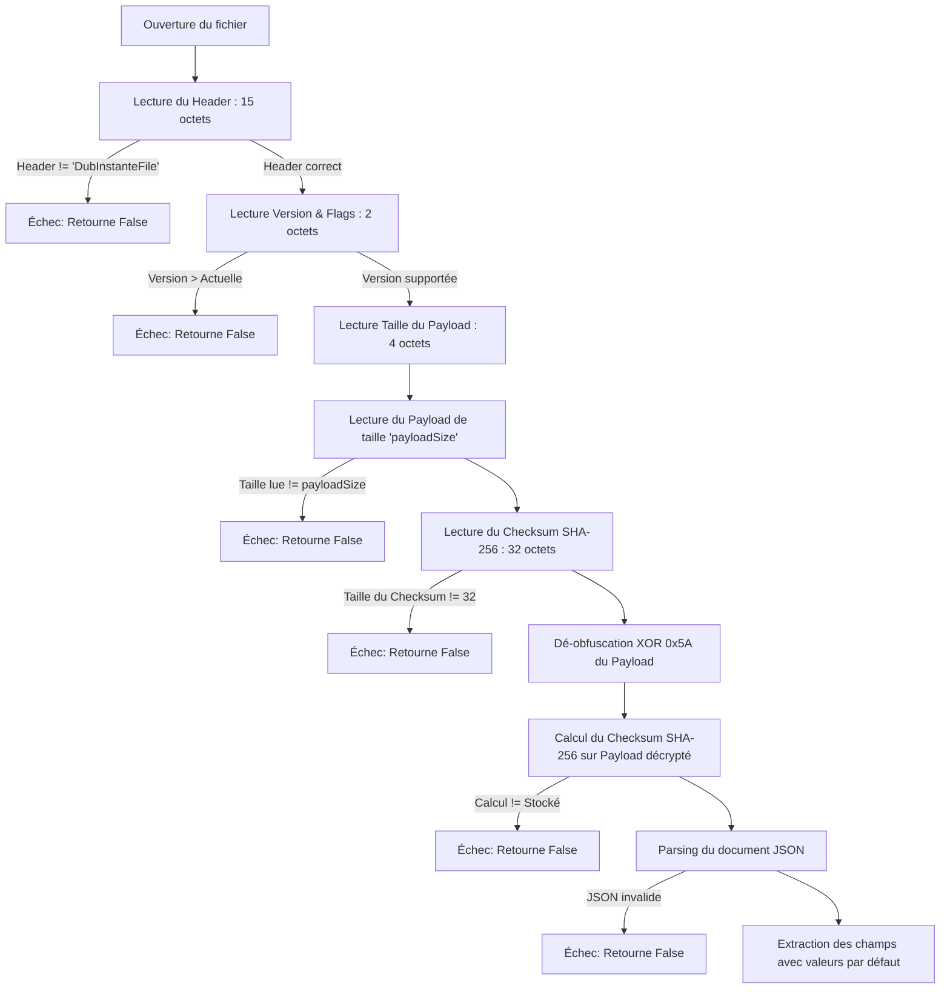

# Rapport d'Analyse : Robustesse du Chargement des Fichiers `.dbi` Corrompus

Ce rapport présente l'analyse de robustesse de la classe `SaveManager` lors de la tentative de chargement de fichiers de session `.dbi` corrompus, modifiés manuellement ou malveillants. 

L'analyse a été menée en écrivant et en compilant un programme de test indépendant exécutant `SaveManager::load` sur une série de fichiers générés avec diverses corruptions.

---

## 1. Processus de Validation Actuel

Lors de l'appel à `SaveManager::load`, les étapes de validation suivantes sont appliquées séquentiellement :



---

## 2. Résultats des Tests de Robustesse

Les scénarios de corruption suivants ont été testés avec succès :

| # | Scénario de Test | Comportement Observé | Statut |
|---|---|---|---|
| **1** | **Fichier valide** | Chargé correctement sans erreur. | **OK** |
| **2** | **Fichier corrompu (octets aléatoires)** | Échoue immédiatement au contrôle du Header. | **Sécurisé** |
| **3** | **Version supérieure/incompatible** | Détecté lors du contrôle de version, rejet propre. | **Sécurisé** |
| **4** | **Checksum SHA-256 incorrect** | Détecté lors de la vérification de l'intégrité, rejet propre. | **Sécurisé** |
| **5** | **Taille de payload géante (ex. 1 Go) mais fichier petit** | La lecture s'arrête à la fin réelle du fichier. La taille finale lue ne correspond pas à la taille déclarée dans le header, rejet propre et immédiat. | **Sécurisé** |
| **6** | **JSON invalide (tronqué/corrompu)** | Détecté par `QJsonDocument::fromJson`, rejet propre. | **Sécurisé** |
| **7** | **Types de données JSON erronés** | Le système utilise des méthodes de fallback robustes (ex. `toString("")`, `toInt(1)`). Les données invalides sont ignorées et remplacées par des valeurs par défaut, évitant tout crash. | **Sécurisé** |
| **8** | **Fichier vide** | Échoue proprement à la lecture du header. | **Sécurisé** |
| **9** | **Header tronqué** | Échoue proprement à la validation du header. | **Sécurisé** |
| **10** | **Fichier tronqué au milieu du payload** | Détecté car la taille lue est inférieure à la taille déclarée, rejet propre. | **Sécurisé** |

---

## 3. Points de Vigilance et Risques Résiduels

Bien que l'application ne produise **aucun Segmentation Fault** lors de nos tests avec des fichiers corrompus standard ou modifiés manuellement, trois points d'attention techniques ont été identifiés dans le code actuel :

### A. Troncature du cast de la taille du Payload (Risque de faux négatif de chargement)
Dans `SaveManager::load` :
```cpp
quint32 payloadSize = qFromLittleEndian(payloadSizeLE);
QByteArray maskedPayload = file.read(payloadSize);
if (maskedPayload.size() != static_cast<int>(payloadSize))
  return false;
```
* **Détail** : Sur les architectures 64 bits, `maskedPayload.size()` renvoie un `qsizetype` (qui équivaut à un entier signé 64 bits). Cependant, `payloadSize` (qui est un `quint32` non-signé) est casté en `int` (signé 32 bits).
* **Conséquence** : Si un payload fait plus de `2 147 483 647` octets (2 Go, hautement improbable pour ce type de fichier), le cast `static_cast<int>(payloadSize)` va déborder et renvoyer une valeur négative. Le test `size() != -X` sera alors vrai, ce qui entraînera l'échec du chargement d'un fichier qui aurait pourtant pu être lu. 
* **Recommandation** : Remplacer `static_cast<int>(payloadSize)` par `static_cast<qsizetype>(payloadSize)`.

### B. Risque d'épuisement de mémoire (OOM) avec de très gros fichiers physiques
* **Détail** : Si un utilisateur malveillant modifie un fichier `.dbi` pour que son en-tête indique une taille de payload légitime très grande (par exemple `100 Mo`) et que le fichier physique fait effectivement cette taille, la méthode `file.read(payloadSize)` tentera d'allouer un `QByteArray` de 100 Mo en RAM *avant* de valider le checksum SHA-256.
* **Conséquence** : Sur des machines avec des ressources limitées, si la taille demandée est excessive (ex. plusieurs gigaoctets) et que le fichier physique fait cette taille, le système peut subir un crash par épuisement de mémoire (OOM Abort / Segfault d'allocation).
* **Recommandation** : Ajouter une limite haute sur la taille maximale autorisée d'un fichier `.dbi` (par exemple, rejeter tout fichier déclarant un payload supérieur à 10 Mo, ce qui est largement suffisant pour du texte de doublage).

### C. Réinitialisation incomplète de l'interface lors du chargement
Dans `MainWindow::onLoadProject` :
* **Détail** : Si le fichier `.dbi` est modifié pour avoir un `trackCount` de 4 mais que les tableaux `audio_tracks` ou `tracks` dans le JSON ne contiennent qu'un seul élément :
  - Le nombre de pistes passe à 4.
  - La boucle de restauration ne met à jour que la piste 0.
  - Les pistes 1 à 3 conservent leurs états précédents ou par défaut.
* **Conséquence** : Aucun crash ne se produit (les structures internes étant correctement dimensionnées en lockstep dans `setTrackCount`), mais cela peut laisser l'interface utilisateur dans un état partiellement initialisé et incohérent.
* **Recommandation** : S'assurer de réinitialiser complètement l'état de toutes les pistes créées avant d'appliquer les valeurs lues dans le fichier JSON.

---

## Conclusion

Le système actuel gère la corruption des fichiers de manière **très robuste** :
1. Les corruptions de structure de fichier (en-tête, version, taille tronquée, checksum invalide) sont interceptées très tôt dans `SaveManager::load`, renvoyant `false` proprement.
2. La couche UI (`MainWindow::onLoadProject`) intercepte ce retour `false` et affiche une boîte de dialogue d'erreur standard propre à l'utilisateur au lieu de planter en tâche de fond.
3. Les données JSON incohérentes (types de données modifiés à la main) sont filtrées de manière sécurisée par les valeurs par défaut de Qt.
